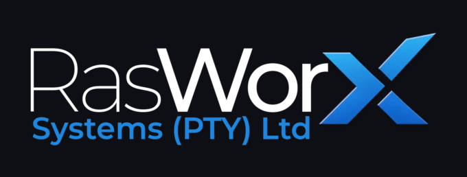

<p align="center">
  
</p>

<h1 align="center">RasWorx Kokoro Narration</h1>

<p align="center">
  A small offline tool that turns a written script into natural-sounding MP3 narration.<br>
  No cloud service, no API key, no cost per character.
</p>

Drop a `.txt` or `.md` script in, get an `.mp3` out. It runs [Kokoro-82M](https://huggingface.co/hexgrad/Kokoro-82M), a small open-weight speech model (82 million parameters, about 330 MB), on your own computer. On an RTX 5050 laptop GPU a 12-minute narration renders in about 15 seconds. It also works on the CPU, just slower.

It is a tool, not an app: a command-line script (`generate.py`) and a small desktop window (`ui.py`) that share the same code, so the audio is identical.

## Features

- Text or Markdown in, MP3 out. Markdown is cleaned before speaking (headings, links, code blocks and front matter are handled).
- Desktop window with file, paste or drag-and-drop input, mood presets, voice, speed and pause controls. Pasted or loaded Markdown is shown rendered (headings, bold, quotes, lists), with an **Edit** switch for the raw text.
- **Preview** the opening of a script in a few seconds before committing to a full render.
- **Pronunciation dictionary**: fix a word once (`Nkosi = en-KO-see`) and every script gets it.
- **Loudness normalisation**: episodes come out at a steady, podcast-level volume.
- Script check: warns about things that read badly aloud (needs the `tts-output` linter, see [Skills](#skills)).
- Output file list in the window: play, or delete several files at once. Keyboard shortcuts for the main actions.
- Your Mood, Voice, Speed and Pause are remembered between sessions.
- Fully offline after the first run. Apache-2.0 model, MIT-licensed code, commercial use is fine.

Limits: 54 fixed voices, no voice cloning, and a fairly even, documentary-style delivery rather than dramatic acting.

## Requirements

- Windows 10 or 11.
- An NVIDIA GPU is recommended (the setup installs the CUDA 12.8 build of PyTorch, which RTX 50-series cards need). Without one, run `setup.bat -Cpu`.
- About 5 GB of disk space, and internet for the first install and the first run.
- Optional: the [Montserrat](https://fonts.google.com/specimen/Montserrat) font for the intended look. The window falls back to Segoe UI.

## Install

1. Download or clone this repository into the folder where you want it to live.
2. Double-click **`setup.bat`**.

**Setup installs into the folder it is run from** (the folder that holds `setup.bat`). It creates `.venv` there, so move the folder before running it, not after. It:

- installs [uv](https://docs.astral.sh/uv/) with winget if you do not have it,
- creates a Python 3.12 environment in `.venv` (Kokoro does not support Python 3.13 or newer, and the setup never touches your system Python),
- installs PyTorch (CUDA 12.8) and the packages in `requirements.txt`,
- creates the `input` and `output` folders,
- links the two Claude skills into `.claude\skills`,
- puts a **Kokoro narration** shortcut on your desktop.

The first time you use it, the model and each new voice download from Hugging Face into `%USERPROFILE%\.cache\huggingface`. That cache lives outside this folder, and nothing model-related is committed to the repository. After that everything works offline.

## Use it

### The window

Double-click the desktop shortcut or `ui.bat`. The window opens full screen.

1. Choose **File** and drop a script on the window or Browse to one (it is read where it is and never changed), or choose **Paste** and paste text. Pasted text is saved as `input\<name>.md` first. Markdown shows as a rendered preview; click **Edit** (or press Ctrl+E) to change the raw text, and **Preview** to render it again.
2. Pick a **Mood** preset, or set Voice, Speed (0.70 to 1.30) and Pause (0 to 3 s) yourself. Voice also accepts a blend such as `af_heart,af_bella`.
3. Click **Preview** to hear the opening (about 15 seconds) with these settings. Nothing is saved.
4. Click **Convert**. The MP3 is written to `output\<name>.mp3`. The model loads in the background when the window opens, so wait for "Ready".

Other controls: **Normalize loudness** (on by default) raises the volume to about podcast level. **Pronunciations** opens the dictionary (see below). **Clear** resets the input (settings stay), **Cancel** stops at the next paragraph. Click the Script check chip to see its warnings. The **Output files** panel plays files, deletes the ones you select after you confirm the list, and opens the input and output folders. Errors go to `ui.log`.

| Shortcut | Action |
|---|---|
| Ctrl+Enter | Convert |
| Ctrl+O | Browse for a script |
| Ctrl+P | Preview (again to stop) |
| Ctrl+E | Switch a Markdown script between Preview and Edit |
| Ctrl+L | Clear |
| Esc | Cancel a running conversion |
| F5 | Refresh the file list |

### Pronunciation dictionary

Click **Pronunciations** (or edit `pronunciations.txt` in this folder) and add one entry per line:

```
# word = how to say it
Nkosi = en-KO-see
Kokoro = /kˈOkəɹO/
```

A plain respelling is spoken as written; text between slashes gives Kokoro the exact sounds. Matching is by whole word, in any capitals. It applies to every conversion and preview, in the window and on the command line, and never touches your script files. `pronunciations.txt` is personal, so it is not part of the repository.

### The command line

```
.venv\Scripts\python generate.py [files...] [--voice ID] [--accent a|b] [--speed N] [--pause SECONDS] [--force] [--cpu] [--no-normalize] [--version]
```

With no arguments it converts every file in `input\` that has no MP3 yet or was edited after its MP3, so it is safe to run repeatedly. `generate.bat` does the same on double-click and passes arguments through.

```
.venv\Scripts\python generate.py input\chapter-3.md --voice bm_george --speed 0.95
.venv\Scripts\python generate.py --force --voice af_bella
.venv\Scripts\python generate.py --voice "af_heart,af_heart,af_bella" --force
```

| Option | Default | Meaning |
|---|---|---|
| `files` | all pending in `input\` | Convert only these files. |
| `--voice` | `af_kore` | Voice ID, a blend (`af_heart,af_bella`, repeat a name to weight it) or a saved `.pt` file. |
| `--accent` | from voice | Language code: `a` American, `b` British, and others. |
| `--speed` | `1.0` | `0.9` is slower and calmer, `1.1` faster. |
| `--pause` | `0.4` | Seconds of silence between paragraphs. |
| `--force` | off | Regenerate even if the MP3 is up to date. |
| `--cpu` | off | Use the CPU instead of the GPU. |
| `--no-normalize` | off | Keep Kokoro's own quiet volume instead of raising it to about -16 dBFS. |
| `--version` | | Print the version and exit. |

Good English voices, roughly in quality order: `af_kore` (default), `af_heart`, `af_bella`, `af_nicole`, `af_aoede`, `af_sarah`, `am_michael`, `am_fenrir`, `am_puck`, `bf_emma`, `bm_george`. The full list is in the [Kokoro voice list](https://huggingface.co/hexgrad/Kokoro-82M/blob/main/VOICES.md).

## Writing scripts that sound good

- Separate paragraphs with a blank line. Each paragraph is spoken in one flow, then a short pause.
- Punctuation drives rhythm: commas are short breaths, full stops are longer ones.
- Spell out numbers, abbreviations and symbols that could be read more than one way ("twenty twenty-six").
- Fix a mispronounced word once in the [pronunciation dictionary](#pronunciation-dictionary), or in one script by respelling it or giving Kokoro the sounds directly: `[Kokoro](/kˈOkəɹO/)`.
- Keep tables and code out of narration scripts.
- Roughly 150 words is one minute of audio, so 10 to 20 minutes is about 1,500 to 3,000 words.

## Skills

Two [Claude](https://claude.com/claude-code) skills live in `.agents\skills\`. They are optional, and the tool works without them.

- **`kokoro-help`** knows this project: voices, speed and pauses, pronunciation fixes, helper scripts and Windows troubleshooting. Claude Code loads it automatically when you work in this folder.
- **`tts-output`** writes or rewrites text so it reads well aloud, tuned for Kokoro, and checks it with a bundled linter. This linter is also what powers the window's **Script check**, so the check works out of the box. You run the skill yourself, for example `/tts-output 15-minute narration about tea`.

To use `tts-output` in all your projects, copy the `tts-output` folder to `%USERPROFILE%\.claude\skills\`. To use it on claude.ai or chatgpt.com, zip the folder and upload it in their Skills settings. That gives you TTS-aware scripts anywhere you write.

## Troubleshooting

- **The GPU is not used.** Run `.venv\Scripts\python -c "import torch; print(torch.__version__, torch.cuda.is_available())"`. You want a version ending in `+cu128` and `True`. If not, run `setup.bat` again.
- **A word is mispronounced.** Add it to the Pronunciations dictionary, or respell it in the script.
- **Drag and drop does nothing.** The `tkinterdnd2` package is missing; run `setup.bat` again. Browse still works.
- **MP3 export fails.** The tool writes a `.wav` next to where the MP3 would be and says so.
- **The window logs an error.** Read `ui.log` in this folder.
- **The first start is slow.** Loading the model cold takes about 45 seconds. Conversions after that are fast.

## Version

The current version is in `version.py` (shown in the window title and by `generate.py --version`). See [CHANGELOG.md](CHANGELOG.md) for what changed.

## Credits and licence

- Code: [MIT](LICENSE), copyright RasWorx Systems (Pty) Ltd. Do what you like with it.
- Speech model: [Kokoro-82M](https://huggingface.co/hexgrad/Kokoro-82M) by hexgrad, Apache-2.0. Weights are downloaded on first run, not stored here.
- Built on the [`kokoro`](https://github.com/hexgrad/kokoro) Python package, PyTorch and libsndfile.
